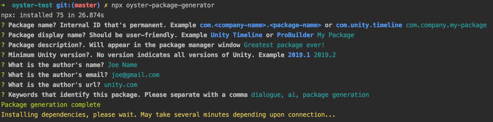
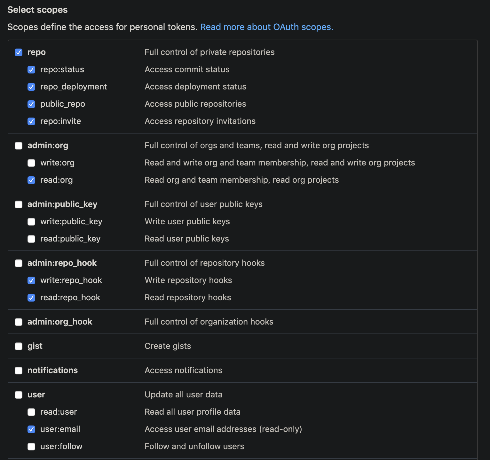

# Oyster Package Generator

[](http://commitizen.github.io/cz-cli/)

Setting up a Unity Package Manger project with cloud builds, automated version numbers, and documentation can take several hours. Oyster Package Generator creates all of this for you by answering a few simple questions about your project.



Features

* Cloud deploy your Unity Package automatically to NPM
* Automatically generates the standard Unity [package structure](https://docs.unity3d.com/Manual/cus-layout.html) for you and populates the package.json
* Version numbers are automatically created from your commits
* Auto-deploying nightly builds as you make commits
* Change logs are generated from commits
* Package generator creates general documentation to use your app
* Allows you to work inside a Unity project without cloning nested repos in `Assets`

**Support**

Join the [Discord Community](https://discord.gg/8QHFfzn) if you have questions or need help.

# Getting Started

In order to use Oyster Package Generator you'll need the following.

* A Mac OS, due to various Linux install scripts this does now work on Windows machines
* [Git](https://git-scm.com/) installed
* [Node.js](https://nodejs.org/en/) installed
* [GitHub](https://github.com/) account (uses GitHub specific publishing features)

## Quick Start

If you don't care about all the granular details just do the following.

1. Create an empty Unity repo (navigate to the root folder)
1. Run `npm init` to prep everything for Git
1. Run `git remote add origin git@github.com:ashblue/YOUR_REPO.git`. Replace `YOUR_REPO` with the proper repo URL. This needs to be done before oyster runs. Reason being it hard writes some Git addresses into your project
1. Run `npx oyster-package-generator` and answer the prompts. Wait for the install script to finish
1. Run `npm install -g semantic-release-cli`
1. Then run `semantic-release-cli setup` and answer the prompts. This will setup cloud deployments for you

Once setup all commits to the `master` branch will generate a new release. All commits to the `develop` branch will generate an unversioned nightly build.

## Running the CLI

To generate your project you'll need to setup a GitHub repo if you haven't in a Unity project. Make sure you set the `origin` remote as the origin is used to auto populate some of the files.

Run the following command and answer the question prompts.

```bash
npx oyster-package-generator
```

Please note if you plan on using Oyster a lot you should globally install it for speed purposes. `npx` can be quite slow since it caches nothing.

```bash
npm install -g oyster-package-generator

# Run the program
oyster
```

You're done. If you want to [setup cloud builds](#setting-up-cloud-builds) you'll need to do a few extra things.

### Making commits to your project

All commits should be made with the following command. Your project will use [Commitizen](https://github.com/commitizen/cz-cli) and enforce syntax via [Commitlint](https://commitlint.js.org).

```bash
npm run commit
```

### Git Flow

You should install and use the [Git Flow](https://www.atlassian.com/git/tutorials/comparing-workflows/gitflow-workflow) branching strategy when working with Oyster generated packages. 

Why do I need GitFlow you might ask? Commits to Oyster's `develop` branch automatically create nightly builds. Commits to `master` automatically generate package releases. Therefore it's a good idea to work out of Git Flow's feature branches and use the branching strategy.

In short **you must** have a `develop` and `master` branch for cloud builds to work properly.

### Licensing

Oyster Package Generator automatically includes an MIT license in the project. You can easily change this by deleting/changing the `package.json` license key and the `LICENSE.md` file if you desire.

## Setting up cloud builds

For cloud builds Oyster uses [Travis CI](https://travis-ci.com/). You'll need to head there, create an account, and enable your repo. Make sure you've checked in the code Oyster generated for you as `.travis.yml` in the root is required for your repo to start building.

### The easy way

Oyster package manager is compatible with [semantic-release-cli](). Run the following commands from the root of your project, fill in the questions, and your keys will automatically be configured.

```bash
npm install -g semantic-release-cli
semantic-release-cli setup
```

### The hard way

This will take a while but you can manually configure your cloud deploy keys. To get builds automatically deploying you'll need an NPM, GitHub, and Travis CI account before proceeding to the next step.

#### Creating the NPM key

To publish to NPM we'll have to [generate an authentication key](https://docs.npmjs.com/creating-and-viewing-authentication-tokens). You must have an [npm](https://www.npmjs.com) account and generate a token. 

Add the key to your Travis CI settings [environment variables](https://docs.travis-ci.com/user/environment-variables/#defining-variables-in-repository-settings) as `NPM_TOKEN`.

#### Creating the GitHub key

For publishing builds and updating changelogs you'll need a GitHub [Personal Access Token](https://github.com/settings/tokens). Your token should look like this.



Add the key to Travis CI settings as `GH_TOKEN`.

Cloud builds should automatically work and publish if everything was setup correctly. Note cloud builds don't start triggering till you've made commits to a branch.

### Concerning Commitlint

If you find cloud builds failing because of pre-existing commit history that doesn't match commitlint. You'll need to temporarily disable the line `commitlint-travis` in `travis.yml`. You can safely turn this back on once you've merged your code to `master`.
